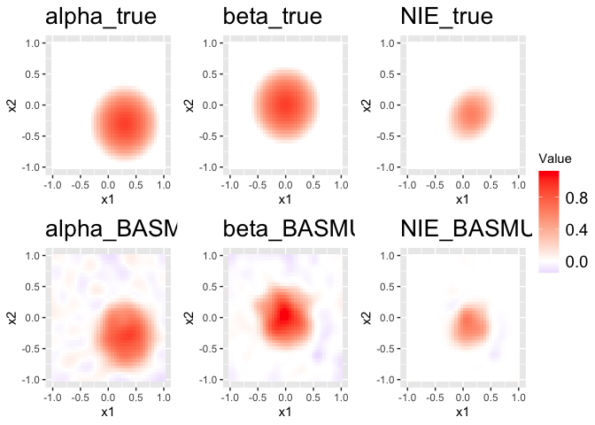

BASMU:Vignette
================
Yuliang Xu
2024-05-16

- [installation](#installation)
- [generate a testing case](#generate-a-testing-case)
  - [create image grids](#create-image-grids)
  - [create true image for alpha, beta, and
    nu.](#create-true-image-for-alpha-beta-and-nu)
  - [generate data](#generate-data)
- [run mediator model](#run-mediator-model)
- [run outcome model](#run-outcome-model)
- [analyze the result](#analyze-the-result)

# installation

``` r
devtools::install_github("yuliangxu/BASMU", force = T)
library(BASMU)
```

# generate a testing case

First, we need to pre-specify parameters for the testing case.

``` r
library(BASMU)
library(BayesGPfit)
#> Loading required package: lattice
library(ggplot2)

in_sigma_M = 2
in_sigma_eta = 1
in_lambda_gen = 0.1
in_lambda_est = 0
n = 300 
nu_set = "sparse" # dense, sparse, null
q = 2
L = 120
num_region = 1
side = 40 
p = side*side # image size
knitr::kable(cbind(in_sigma_M,
                   in_lambda_gen,
                   in_lambda_est,
                   n, q, L, p,
                   in_sigma_eta))
```

| in_sigma_M | in_lambda_gen | in_lambda_est |   n |   q |   L |    p | in_sigma_eta |
|-----------:|--------------:|--------------:|----:|----:|----:|-----:|-------------:|
|          2 |           0.1 |             0 | 300 |   2 | 120 | 1600 |            1 |

## create image grids

``` r


region_idx = vector("list",num_region)
grids = GP.generate.grids(d=2L,num_grids=side)


idx_matr = matrix(1:(side*side),ncol = side)
side_per_region = side/sqrt(num_region)

for(r in 1:num_region){
  idx = rep(NA,(side_per_region)^2)
  colr = r - floor(r/sqrt(num_region))*sqrt(num_region);if(colr==0){
    colr = sqrt(num_region)
  }
  rowr = ceiling(r/sqrt(num_region));
  col_range = (max(colr-1,0):colr)*side_per_region;col_range[1] = col_range[1]+1;
  row_range = (max(rowr-1,0):rowr)*side_per_region;row_range[1] = row_range[1]+1;
  region_idx[[r]] = c(idx_matr[row_range[1]:row_range[2],col_range[1]:col_range[2]])

}
```

## create true image for alpha, beta, and nu.

You can use other image patterns.

``` r


beta_img = simulate_round_image(side = side, range = c(0,1))

alpha_img = simulate_round_image(center_shift = c(0.3,-0.3), side = side, range = c(0,1))

grids_df = beta_img$grids_df
map_img = function(x, low, high){
  x[x<low] = 0;
  x[x>high] = high
  return(x)
}

## you can generate other matern basis functions using the following function
# basis = generate_matern_basis2(beta_img$grids_df, list(1:p), 0.3*p, scale = 2,nu = 1/5)
basis  = readRDS(file.path(basmu_path,"example",paste("basis_1region_p",p,"_L",L,".rds",sep=""))) 

if(nu_set == "sparse"){
  nu_img = simulate_triang_image(center_shift = c(0.3,-0.3), side = side, rad = 0.5)
  nu_img$img = nu_img$img+0.4
  nu_img$img = map_img(nu_img$img, 0.5,1); summary(nu_img$img)
  sp_nu = nu_img$img
  plot_img(nu_img$img,grids_df = nu_img$grids_df,col_bar = c(-1,1),title="sparse nu")
}else if(nu_set == "dense"){
  theta_nu = rnorm(L, sd=0.5)*sqrt(basis$Phi_D[[1]])
  nu = basis$Phi_Q[[1]]%*%theta_nu; summary(nu)
  dense_nu = nu
  plot_img(nu,grids_df,col_bar = c(-1,1), title="dense nu")
  nu_img = list(img = nu, grids_df = grids_df)
}else if(nu_set == "null"){
  nu = rep(0,p)
  nu_img = list(img = nu, grids_df = grids_df)
  null_nu = nu
}
```

<!-- -->

``` r


L_idx = vector("list",num_region)
for(r in 1:num_region){
  if(r == 1){prev_ct = 0}else{prev_ct = sum(unlist(lapply(basis$Phi_D,length))[1:(r-1)])}
  L_idx[[r]] = 1:length(basis$Phi_D[[r]]) + prev_ct
}
L_idx_cpp = lapply(L_idx, function(x){x-1})
basis$region_idx_cpp = lapply(basis$region_idx_block, function(x){x-1})
basis$L_idx_cpp = L_idx_cpp
```

## generate data

``` r

beta = beta_img$img
datsim = Unconfounded_mediation_data_constrained_eta(beta_img$img, alpha_img$img,n,q = q, 
                                                     lambda = in_lambda_gen, 
                                                     lambda_nu = in_lambda_gen,
                                                     nu_scale = 1,
                                                     nu = nu_img$img,
                                                     Q = basis$Phi_Q[[1]], 
                                                     D = basis$Phi_D[[1]],
                                                     sigma_eta = in_sigma_eta,
                                                     sigma_M = in_sigma_M,sigma_Y=0.01, gamma = 2)
```

# run mediator model

``` r

n_mcmc = 1e3
num_block = 1
controls_m = list(lambda = 0,
                  n_mcmc = n_mcmc,
                  stop_adjust = 0.8*n_mcmc,
                  start_joint = 0,
                  interval_step = 10,
                  interval_eta = 10,
                  thinning = 1,
                  target_accept_vec = rep(0.2,num_region),
                  step = 1e-2/n)

init_m = list(
  theta_alpha = rep(0.5,L),
  D=unlist(basis$Phi_D), # recompute D
  theta_eta = matrix(0,nrow = L, ncol=n),
  sigma_M = 1,
  sigma_alpha = 1,
  sigma_eta = 1,
  theta_zetam = matrix(rep(0.1,L*q),L,q))
print("MALA for M ....")
#> [1] "MALA for M ...."

mediator_model = BASMU::BASMU_mediator(t(datsim$M),
                       datsim$X, t(datsim$C), basis$L_all,
                       num_region = length(basis$region_idx_cpp) ,
                       region_idx = basis$region_idx_cpp,
                       n_mcmc = controls_m$n_mcmc ,
                       basis$Phi_Q,
                       stop_burnin = controls_m$stop_adjust,
                       lambda = controls_m$lambda,
                       target_accept_vec = controls_m$target_accept_vec,
                       init = init_m,
                       interval = controls_m$interval_step, # adjust step every 10 iter
                       interval_eta = controls_m$interval_eta,
                       begin_save_eta =  0.8*n_mcmc,
                       thinning = controls_m$thinning,
                       step = controls_m$step)
#> iter=0; sigma_eta2=1; sigma_Y2=16.0031
#> iter=50; sigma_eta2=0.753803; sigma_Y2=6.03713
#> iter=100; sigma_eta2=0.702138; sigma_Y2=5.25295
#> iter=150; sigma_eta2=0.727032; sigma_Y2=4.57609
#> iter=200; sigma_eta2=0.754528; sigma_Y2=4.32395
#> iter=250; sigma_eta2=0.751922; sigma_Y2=4.37425
#> iter=300; sigma_eta2=0.749223; sigma_Y2=4.35754
#> iter=350; sigma_eta2=0.790907; sigma_Y2=4.23047
#> iter=400; sigma_eta2=0.829043; sigma_Y2=4.24645
#> iter=450; sigma_eta2=0.847883; sigma_Y2=4.20298
#> iter=500; sigma_eta2=0.892116; sigma_Y2=4.0563
#> iter=550; sigma_eta2=0.885609; sigma_Y2=4.06008
#> iter=600; sigma_eta2=0.912249; sigma_Y2=4.04006
#> iter=650; sigma_eta2=0.885531; sigma_Y2=4.19768
#> iter=700; sigma_eta2=0.878617; sigma_Y2=4.14227
#> iter=750; sigma_eta2=0.842591; sigma_Y2=4.12857
#> iter=800; sigma_eta2=0.865376; sigma_Y2=4.11637
#> iter=850; sigma_eta2=0.850639; sigma_Y2=4.11986
#> iter=900; sigma_eta2=0.899152; sigma_Y2=4.04622
#> iter=950; sigma_eta2=0.886722; sigma_Y2=4.05132

# computation time in minutes
mediator_model$Timer/1e9/60
#> start of precomputation      start of iteration          stop of burnin 
#>            2.050000e-09            5.911585e-05            1.201890e-01 
#>       end of iterations 
#>            1.502918e-01

n_mcmc = dim(mediator_model$theta_alpha_mcmc)[2]-1
theta_sample = mediator_model$theta_alpha_mcmc[,ceiling(n_mcmc*0.9):n_mcmc]
alpha_sample = STGP_mcmc(theta_sample,region_idx,basis,lambda = 0)
alpha_mean = apply(alpha_sample,1,mean)
alpha_IP = apply(alpha_sample,1,function(x){mean(x!=0)})
delta_sp = 1*(alpha_IP>0.5)

M_paras = list(alpha = alpha_mean)
```

# run outcome model

``` r
n_mcmc = 5e3
init_y = list(theta_beta = rep(1,L),
              theta_nu = rep(1,L),
              nu = rep(1,p),
              a_sigma_beta = 1, b_sigma_beta = 1,
              D=unlist(basis$Phi_D), # recompute D
              sigma_Y = 0.1,
              sigma_beta = 0.1,
              cb = 0 ,
              zetay = rep(1,dim(datsim$C)[1]),
              gamma = 1)# L by n

# compute the unmeasured confounder eta
in_eta = BASMU::Low_to_high(mediator_model$theta_eta_mean, p, basis$Phi_Q,
                     basis$region_idx_cpp, basis$L_idx_cpp)


controls_y = list(n_mcmc = n_mcmc, 
                  stop_burnin = 0.8*n_mcmc,
                  start_joint = -1, 
                  lambda = 0,
                  interval_step = 10,
                  interval_thin = 1,
                  stop_adjust = 0.8*n_mcmc,
                  target_accept_vec = rep(0.2,num_region),
                  step = 1e-2/n)


outcome_model = BASMU::BASMU_outcome(Y = datsim$Y, M = t(datsim$M),
                         X = datsim$X, C = t(datsim$C), 
                         eta = in_eta,
                         delta_sp = delta_sp,
                         L_all = basis$L_all,
                         num_region = num_block,
                         region_idx = basis$region_idx_cpp,
                         n_mcmc = controls_y$n_mcmc,
                         K = basis$Phi_Q, 
                         stop_burnin = controls_y$stop_burnin,
                         start_joint = controls_y$start_joint, 
                         lambda = in_lambda_est, 
                         target_accept_vec = rep(0.2,num_block),
                         a=1,b=1,
                         init = init_y,
                         step = controls_y$step,
                         interval_step = controls_y$interval_step, 
                         interval_thin = controls_y$interval_thin)
#> iter=0; sigma_Y2 = 222.816; sigma_nu2=1.81771
#> iter=250; sigma_Y2 = 3032.77; sigma_nu2=19.5313
#> iter=500; sigma_Y2 = 280.114; sigma_nu2=13.2713
#> iter=750; sigma_Y2 = 279.49; sigma_nu2=7.22197
#> iter=1000; sigma_Y2 = 231.747; sigma_nu2=8.33883
#> iter=1250; sigma_Y2 = 211.531; sigma_nu2=5.59417
#> iter=1500; sigma_Y2 = 218.31; sigma_nu2=5.29271
#> iter=1750; sigma_Y2 = 183.87; sigma_nu2=3.87626
#> iter=2000; sigma_Y2 = 224.595; sigma_nu2=3.28323
#> iter=2250; sigma_Y2 = 152.705; sigma_nu2=2.93871
#> iter=2500; sigma_Y2 = 202.727; sigma_nu2=3.57324
#> iter=2750; sigma_Y2 = 181.694; sigma_nu2=2.69064
#> iter=3000; sigma_Y2 = 221.035; sigma_nu2=3.43014
#> iter=3250; sigma_Y2 = 162.746; sigma_nu2=2.21465
#> iter=3500; sigma_Y2 = 190.873; sigma_nu2=2.68308
#> iter=3750; sigma_Y2 = 172.735; sigma_nu2=1.92879
#> iter=4000; sigma_Y2 = 202.558; sigma_nu2=1.82853
#> iter=4250; sigma_Y2 = 174.301; sigma_nu2=2.261
#> iter=4500; sigma_Y2 = 154.328; sigma_nu2=1.37133
#> iter=4750; sigma_Y2 = 166.321; sigma_nu2=2.28573

burnin = ceiling(n_mcmc*0.9):(n_mcmc-1)
spnuY_nu_mean = apply(outcome_model$nu_mcmc_thin[,burnin],1,mean)
spnuY_nu_IP = apply(outcome_model$nu_mcmc_thin[,burnin],1,function(x){mean(x!=0)})
theta_sample = outcome_model$theta_beta_mcmc[,burnin]
beta_sample = STGP_mcmc(theta_sample,region_idx,basis,lambda = 0)
spnuY_beta_mean = apply(beta_sample,1, mean)


theta_sample = outcome_model$theta_beta_mcmc[,burnin]
beta_sample = STGP_mcmc(theta_sample,
                        region_idx,
                        basis,lambda = in_lambda_gen)

Y_paras = list(beta = apply(beta_sample,1,mean),
                nu = apply(outcome_model$nu_mcmc_thin[,burnin],1,mean),
                nu_ip = apply(outcome_model$nu_mcmc_thin[,burnin],1,function(x){mean(x!=0)}),
                gamma = mean(outcome_model$gs$gamma_mcmc[burnin]),
                cy = 0,
                eta = in_eta,
                zetay = apply(outcome_model$gs$zetay_mcmc[,burnin],1,mean))
```

# analyze the result

``` r

img_list = list(alpha_true = datsim$true_params$alpha,
                beta_true = datsim$true_params$beta,
                NIE_true = datsim$true_params$alpha * datsim$true_params$beta,
                alpha_BASMU = M_paras$alpha,
                beta_BASMU = Y_paras$beta,
                NIE_BASMU = M_paras$alpha * Y_paras$beta)

plot_multi_img(img_list, grids_df)
```

<!-- -->
